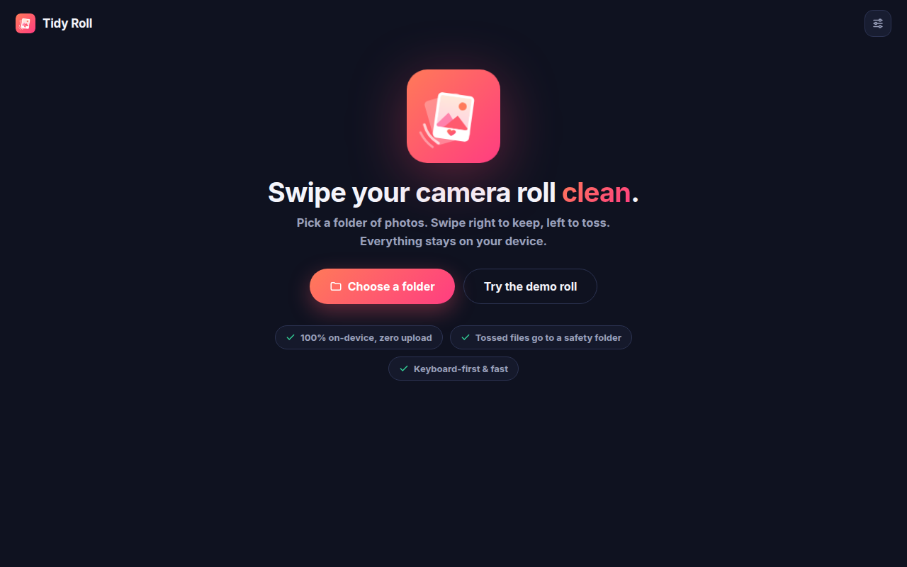
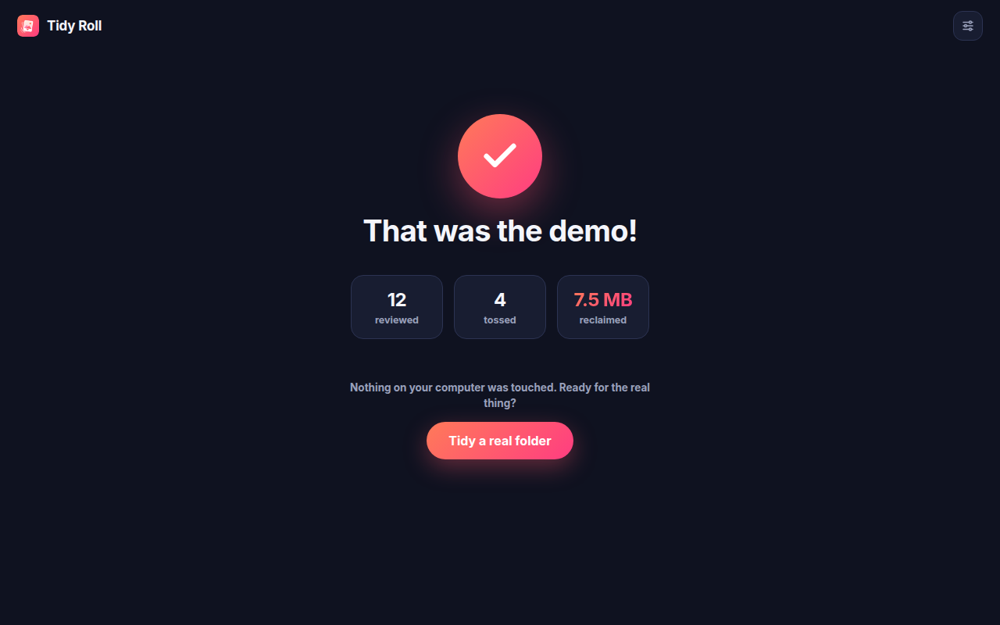

<p align="center">
  
</p>

<p align="center">
  <a href="https://github.com/gr8monk3ys/tidy-roll/actions/workflows/ci.yml"></a>
  
  
  
</p>

# Tidy Roll

**A Tinder-swipe UI/UX for cleaning up your photos.**

Tidy Roll deals your photos out one card at a time: swipe **right to keep**,
**left to toss**, and watch the megabytes you'll reclaim tick up. When you're
done you get a summary of everything you tossed — nothing is touched until
you confirm it. It ships two ways:

| Where | What | Lives in |
| --- | --- | --- |
| 🖥 **Desktop browsers** (Chrome, Edge, Brave, Arc, Opera) | MV3 extension that tidies any local folder | [`extension/`](extension/) |
| 📱 **Android & iOS** | Native Expo/React Native app that tidies your actual camera roll | [`mobile/`](mobile/) |

## ✨ Features

- 🃏 **Swipe deck** — drag with mouse or touch, with springy card physics and KEEP/TOSS stamps
- ⌨️ **Keyboard-first** — `←` toss, `→` keep, `↓` skip for now, `Z` undo
- 🗂 **Safety folder by default** — tossed files move to a `Tidy Roll - Tossed` folder inside the folder you're tidying; permanent delete is opt-in
- 🧾 **Review before anything happens** — a summary grid with per-photo restore, so a stray swipe never costs you a memory
- 📊 **Space reclaimed** — live per-session stats plus lifetime totals in the popup
- 🔀 **Review orders** — oldest first, newest first, largest first, or shuffle
- 📁 **Recent folders & subfolder scanning** — pick up where you left off
- 🎞 **Videos too** — mp4/webm play right on the card (toggle in settings)
- 🔒 **100% on-device** — no accounts, no uploads, no analytics, no network calls. The only permission it asks for is `storage` (for your settings and stats)
- 🧪 **Demo roll** — try the whole flow on bundled sample photos without touching your files

## 📸 Screenshots

| The deck | The summary |
| --- | --- |
|  |  |

| Home | All done |
| --- | --- |
|  |  |

## 🚀 Install

### Chrome Web Store

Coming soon — the store package is built from this repo with `npm run package`.

### Load unpacked (today)

1. Clone or [download](https://github.com/gr8monk3ys/tidy-roll/archive/refs/heads/main.zip) this repo.
2. Open `chrome://extensions` in Chrome (or Edge/Brave/Arc/Opera).
3. Turn on **Developer mode** (top right).
4. Click **Load unpacked** and select the `extension/` folder.
5. Pin Tidy Roll and click it → **Start tidying**.

> The extension uses the [File System Access API](https://developer.mozilla.org/en-US/docs/Web/API/File_System_API),
> so it needs a Chromium-based browser. Firefox and Safari don't support
> extension folder access yet — on your phone, use the mobile app below.

### 📱 Android & iOS

The native app in [`mobile/`](mobile/) brings the same swipe flow to your
actual camera roll — month-by-month sessions, On This Day, albums,
bookmarks, and staged deletes through the system photo library, so freed
space is real space.

```bash
cd mobile
npm install
npm run ios      # or: npm run android
```

Store-ready EAS build profiles and the Google Play / App Store metadata are
included — see [`mobile/README.md`](mobile/README.md) and
[`mobile/store/`](mobile/store/).

## 🕹 How it works

1. **Pick a folder** (or hit *Try the demo roll* first).
2. **Swipe.** Right/`→` keeps, left/`←` tosses, `↓` skips to the end of the deck, `Z` undoes. Nothing is written to disk during this phase.
3. **Review the summary.** Restore anything you want back with one click.
4. **Confirm.** Tossed files move into `Tidy Roll - Tossed` inside your folder (default), or are deleted permanently if you switched modes in settings.

| Key | Action |
| --- | --- |
| `→` | Keep |
| `←` | Toss |
| `↓` | Skip for now (comes back at the end) |
| `Z` | Undo last swipe |

## 🔐 Privacy

Tidy Roll never sees the internet. There is no server, no telemetry, no
tracking, and the extension requests no host permissions — see
[PRIVACY.md](PRIVACY.md) for the full policy. Folder access is granted by you,
per folder, through the browser's own picker, and can be revoked at any time.

## 🛠 Development

No build step, no dependencies — the extension is plain ES modules.

```bash
npm test              # unit tests (node:test) for the session logic + manifest checks
npm run package       # build dist/tidy-roll-v<version>.zip for the Chrome Web Store
npm run assets        # regenerate icons/banner/promo tiles from assets/logo.svg
npm run screenshots   # re-capture README/store screenshots headlessly
```

The asset scripts need `playwright` resolvable (e.g. `npm i -g playwright`).

```text
extension/            the unpacked extension (this is what ships)
  manifest.json       MV3 manifest — storage permission only
  popup/              toolbar popup: lifetime stats + launch button
  app/                the full-tab swipe app
    core.js           pure session state machine (unit tested)
    files.js          File System Access layer; all disk writes live here
    demo.js           bundled demo roll
mobile/               Android/iOS app (Expo / React Native, self-contained)
assets/               brand source (logo.svg) + generated art
scripts/              asset/screenshot/packaging tooling
tests/                node:test suites
```

Design tokens: gradient `#FF7A59 → #FF3D81` on ink `#0F1220`, keep
`#34D399`, toss `#FF4D67`.

## 🗺 Roadmap

- [ ] Near-duplicate detection (perceptual hashing) to auto-group burst shots
- [ ] HEIC preview via a WASM decoder
- [ ] Session resume for folders with thousands of photos
- [ ] Localization

## 📄 License

[GPL-3.0](LICENSE) © [gr8monk3ys](https://github.com/gr8monk3ys)
