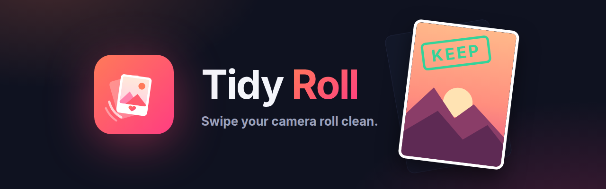
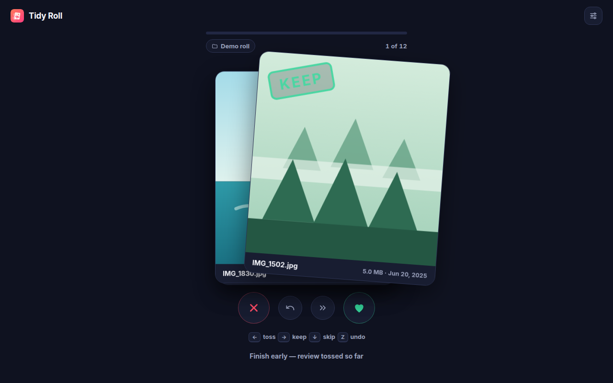
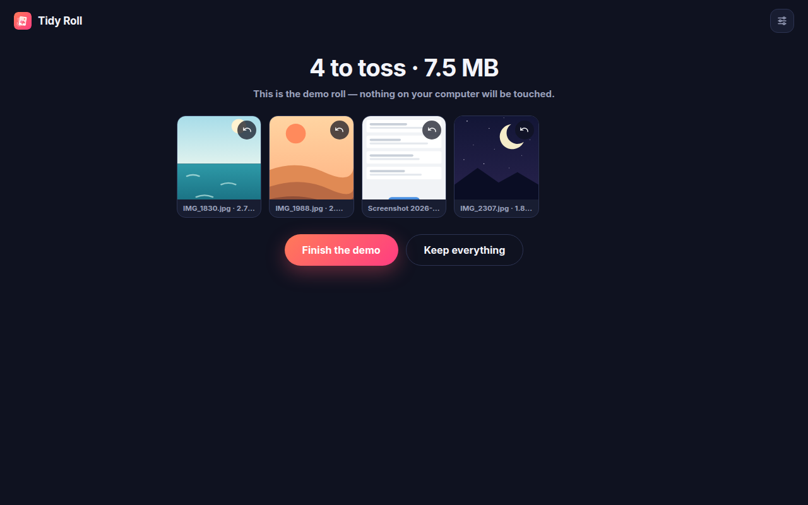

<p align="center">
  
</p>

<p align="center">
  <a href="https://github.com/gr8monk3ys/tidy-roll/actions/workflows/ci.yml"></a>
  <a href="https://github.com/gr8monk3ys/tidy-roll/actions/workflows/codeql.yml"></a>
  
  
  
  
</p>

# Tidy Roll

**A Tinder-swipe UI/UX for cleaning up your photos.**

Tidy Roll deals your photos out one card at a time: swipe **right to keep**,
**left to toss**, and watch the megabytes you'll reclaim tick up. When you're
done you get a summary of everything you tossed — nothing is deleted until you
confirm it.

🌐 **[Try the live demo →](https://tidyroll-legal.vercel.app)** — the real swipe
deck runs right on the site, no install needed.

Free, no ads, no accounts, no tracking. It runs everywhere your photos are:

| Where | What | Lives in |
| --- | --- | --- |
| 📱 **Android & iOS** | Native app that tidies your actual camera roll | [`mobile/`](mobile/) |
| 🌐 **The web** | Showcase site with a playable demo of the swipe deck | [`site/`](site/) |
| 🖥 **Desktop browsers** | Optional extension that tidies any local folder | [`extension/`](extension/) |

## 📱 Android & iOS

The main event. The native app brings the swipe flow to your real camera roll —
month-by-month sessions, **On This Day**, albums, bookmarks, and staged deletes
through the system photo library, so the space you free up is space you actually
get back.

```bash
cd mobile
npm install
npm run android      # or: npm run ios
```

iOS runs in Expo Go. Android may need a development build for full
media-library access on recent versions. Store-ready EAS build profiles and the
Play/App Store metadata are included — see [`mobile/README.md`](mobile/README.md)
and [`mobile/store/`](mobile/store/).

> **Not on the stores yet.** Everything needed to submit is prepared; what's
> left is running the EAS builds against your own developer accounts. The
> [submission checklist](mobile/store/submission-checklist.md) walks through it.

### Features

- 🃏 **Swipe deck** — springy card physics with KEEP/TOSS stamps
- 🗓 **On This Day** — revisit memories from this date across the years, with a streak
- 📆 **Month-by-month** — chronological cleanup with saved progress
- 🔀 **Random** — shuffle a chunk of recents when you can't face the whole roll
- 📚 **Albums** — swiping left removes from the album or deletes from the library, your choice
- 🔖 **Bookmarks** — park the hard calls and come back to them
- 🧾 **Staged deletes** — nothing leaves your library until you confirm
- 📊 **Stats** — what you've reviewed, tossed, and reclaimed

## 🌐 The site

[tidyroll-legal.vercel.app](https://tidyroll-legal.vercel.app) — Next.js 15,
Tailwind 4 and Framer Motion, with a fully playable swipe deck in the hero. It
also serves the [support](https://tidyroll-legal.vercel.app/support),
[privacy](https://tidyroll-legal.vercel.app/privacy) and
[terms](https://tidyroll-legal.vercel.app/terms) pages the app stores require.

```bash
cd site
npm install
npm run dev
```

## 🖥 Browser extension (optional)

A Manifest V3 extension that applies the same swipe flow to any folder on your
computer — handy for a Downloads or Screenshots folder. It's a bonus, not the
main product.

<details>
<summary>Install and details</summary>

1. Clone or [download](https://github.com/gr8monk3ys/tidy-roll/archive/refs/heads/main.zip) this repo.
2. Open `chrome://extensions` (or Edge/Brave/Arc/Opera).
3. Turn on **Developer mode**, click **Load unpacked**, and select `extension/`.
4. Pin Tidy Roll and click it → **Start tidying**.

Keyboard-first: `←` toss, `→` keep, `↓` skip, `Z` undo. Tossed files move to a
`Tidy Roll - Tossed` folder inside the folder you tidied; permanent delete is
opt-in and confirms twice. Includes review orders, subfolder scanning, video
playback, recent folders, and a demo roll.

It uses the [File System Access API](https://developer.mozilla.org/en-US/docs/Web/API/File_System_API),
so it needs a Chromium-based browser. Firefox and Safari don't support
extension folder access yet.

| The deck | The summary |
| --- | --- |
|  |  |

</details>

## 🔐 Privacy

Tidy Roll never sees the internet. No accounts, no servers, no telemetry, no
crash reporting, no ads, no third-party SDKs. The mobile app uses the system
photo library; the extension reads from a folder you pick through the browser's
own picker and requests no host permissions. See
[PRIVACY.md](PRIVACY.md) — and because it's open source, you don't have to take
our word for it.

## 💸 Price

Free, and intended to stay that way — no ads, no subscription, no paywall on the
core experience. See [docs/MARKETING.md](docs/MARKETING.md) for how the store
fees are funded without compromising that.

## 🛠 Development

```bash
npm test              # extension unit tests (node:test) + manifest checks
npm run package       # build dist/tidy-roll-v<version>.zip
npm run assets        # regenerate all brand art + mobile icons from assets/logo.svg
npm run screenshots   # re-capture screenshots headlessly

cd mobile && npm run lint && npm run typecheck && npm test
cd site   && npm run build
```

The asset scripts need `playwright` resolvable (e.g. `npm i -g playwright`).

```text
mobile/               Android/iOS app (Expo / React Native) — the main product
  src/theme.ts        design tokens; screens reference these, never raw hex
  store/              Play + App Store metadata and submission checklist
site/                 showcase site (Next.js 15 + Tailwind 4 + Framer Motion)
  app/                landing page, support, privacy, terms, generated OG image
extension/            optional MV3 browser extension
  app/core.js         pure session state machine (unit tested)
  app/files.js        File System Access layer; all disk writes live here
assets/               brand source (logo.svg) + generated art
scripts/              asset/screenshot/packaging tooling
tests/                node:test suites
docs/                 store listing kit + marketing playbook
```

Design tokens: gradient `#FF7A59 → #FF3D81` on ink `#0F1220`, keep `#34D399`,
toss `#FF4D67`. `assets/logo.svg` is the single source of truth for all icons —
run `npm run assets` rather than editing PNGs.

## 🗺 Roadmap

- [ ] Ship to Google Play, then the App Store
- [ ] Near-duplicate detection (perceptual hashing) to auto-group burst shots
- [ ] HEIC preview via a WASM decoder
- [ ] Localization

## 📄 License

[GPL-3.0](LICENSE) with an [additional permission for app store
distribution](LICENSE-EXCEPTION.md) © 2026 [gr8monk3ys](https://github.com/gr8monk3ys)

Contributions are accepted under those same terms — see
[CONTRIBUTING.md](CONTRIBUTING.md).
